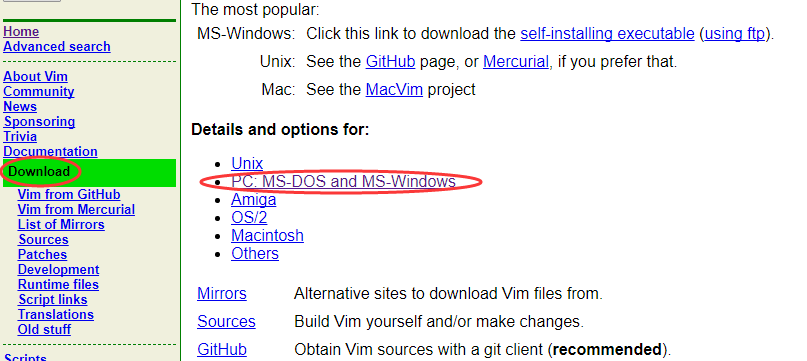
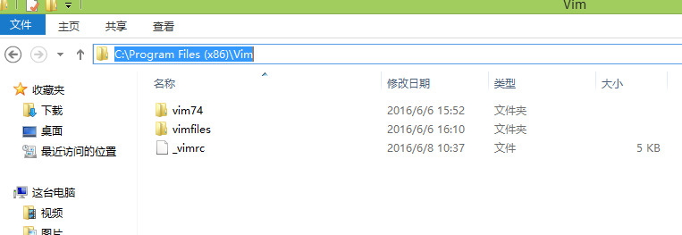

# 一、Vim介绍

Vim 是 Linux 系统上的最著名的文本/代码编辑器，也是早年的 Vi 编辑器的加强版。它的最大特色是完全使用键盘命令进行编辑，脱离了鼠标操作虽然使得入门变得困难，但上手之后键盘流的各种巧妙组合操作却能带来极为大幅的效率提升。由于 Vim 的可配置性非常强，各种插件、语法高亮配色方案等多不胜数，无论作为代码编辑器或是文稿撰写工具都非常给力……

而 gVim 则是其 Windows 版，下文介绍如何安装使用。

# 二、Vim安装(Windows下其实是gVim)

1. 下载 GVIM

官方网站：http://www.vim.org

 图1   

2. 运行下载的安装程序，并按照说明一步一步正确安装即可。

我这里安装的路径是 C:\Program Files (x86)\Vim\，安装完是这样的

 图2

3. 配置文件_vimrc   

顺便提一句，在unix/linux中，文件名可以以”.”开头，表明此文件是隐藏的。而在windows中，不允许文件名以”.”开头，所以，windows版本的vim，将读取_vimrc来做为自己的配置文件。   

在今后使用Vim的日子里，你会频繁的更改你的_vimrc.
